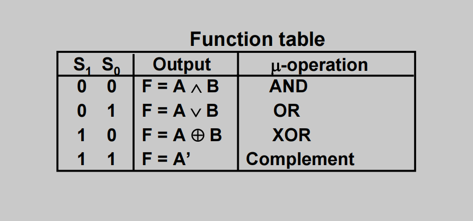

## Verilog code of a 4-bit Micro Hardware Implementation of Logic Microoperations with testbench

Here is verilog code of a 4-bit Micro Hardware Implementation of Logic Microoperations with testbench module like the picture below:

with status table like:

